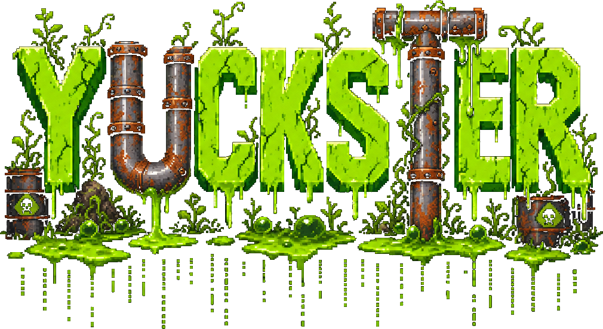

<p align="center">
  
</p>

<p align="center">
  <a href="https://github.com/afwlehmann/yuckster/actions/workflows/ci.yml"></a>
</p>

An 80s-style pipe-puzzle browser game. Guide the green yuck from the source to the drain before it spills.

## Play

```sh
nix develop -c npm run dev
```

Then open the URL Vite prints (default http://localhost:5173).

## How it works

- **8x8 grid** of dirty pipes on a gravel/mud field.
- The **source** (nozzle) and **drain** sit on random border cells pointing inward, shuffled each level.
- You hold **one piece at a time** from an endless shuffled queue of straights, elbows, and crossings. Place it, get the next.
- After a countdown (10s on Normal) the **yuck starts flowing** slowly through the pipes. If it reaches a dead end, you lose. Reach the drain, you win the level.
- **Crossings** pass straight through (L↔R or T↔B) — they never turn.
- Later levels add up to **5 fixed pre-placed pieces** as obstacles the yuck must route around (or through).
- A **rat** wanders the grid — squish it by placing a piece on top for 75 bonus points.

### Controls

| Action         | Keys                   |
| -------------- | ---------------------- |
| Move cursor    | `↑ ↓ ← →` or `H J K L` |
| Rotate CW      | `E`                    |
| Rotate CCW     | `W`                    |
| Place piece    | `SPACE`                |
| Pause / Resume | `P` or `ESC`           |
| Quit to menu   | `ENTER` (while paused) |
| Toggle music   | `M`                    |

### Difficulties

Four Doom-ish presets selectable from the main menu (persisted in `localStorage`):

| Name            | Countdown | Flow    | Fixed pieces from |
| --------------- | --------- | ------- | ----------------- |
| SLUDGE PUPPY    | 15s       | slow    | level 4           |
| GOO TROOPER     | 10s       | medium  | level 2           |
| ULTRA-OILER     | 7s        | fast    | level 1           |
| NIGHTMARE CRUDE | 5s        | fastest | level 1 (max 5)   |

## Development

All tasks run inside the Nix dev shell:

```sh
nix develop -c npm run typecheck   # tsc --noEmit
nix develop -c npm run lint        # eslint
nix develop -c npm run format      # prettier --write
nix develop -c npm test            # vitest run
nix develop -c npm run build       # vite build
```

## Architecture

- **`src/game/`** — pure, tested domain logic: types, seeded RNG, piece geometry, board generation, flow simulation, game state machine. No DOM, no mutation — every transition returns a new state record.
- **`src/render/`** — Canvas 2D rendering: procedural pixel-art sprite cache (pipes, yuck, gravel), 5x7 bitmap font, HUD, board compositor, parallax menu background, police helicopter, rat, pause blur, screen shake.
- **`src/screen.ts`** — app-level screen machine (menu ↔ game ↔ pause ↔ gameover) and input dispatch.
- **`src/audio.ts`** — WebAudio chiptune synth (no audio files; suspended on pause).
- **`src/music.ts`** — HTMLAudioElement streaming music.
- **`src/input.ts`** — keyboard → intent translation.
- **`src/main.ts`** — bootstraps canvas/audio and runs the RAF loop.
